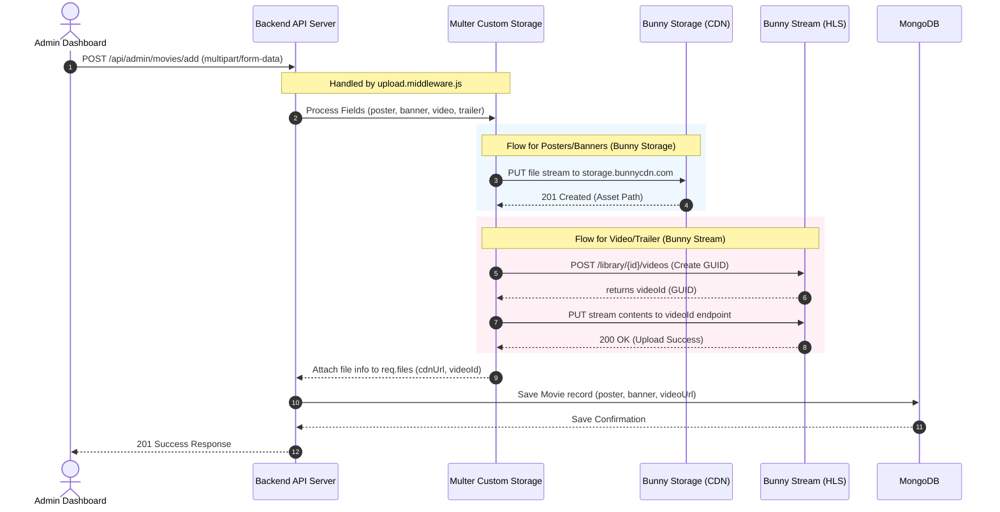

# CatchWatch Content Upload and Playback Architecture

This document provides a detailed overview of the technical workflows for content upload and video playback in **CatchWatch**. It covers the integration with **Bunny.net** (both Bunny Storage and Bunny Stream), the database schema mapping, and the frontend adaptive playback player.

---

## 1. Executive Summary

CatchWatch uses **Bunny.net** as its content delivery network (CDN) and streaming provider. Depending on the type of media file and environment configuration, it routes media through one of two services:
1. **Bunny Storage (Object Storage + Pull Zone CDN)**: Used for static assets (images like posters, banners, cast pictures) and fallback videos. Files are uploaded as-is and served via standard CDN URLs.
2. **Bunny Stream (Video Streaming Platform)**: Used for main movies, episodes, and trailers. Videos are uploaded to a video library, automatically transcoded into multiple resolutions (1080p, 720p, etc.), and packaged for adaptive streaming using HLS (`.m3u8`) and direct MP4 downloads/streams.

---

## 2. Technical Component Directory

* **Backend Upload Middleware**: [upload.middleware.js](./backend/middlewares/upload.middleware.js)  
  *Interceptor using `multer` that handles inbound streams and uploads them directly to Bunny.net.*
* **Bunny CDN Service Wrapper**: [bunnyCDN.js](./backend/cdn/bunnyCDN.js)  
  *Contains the HTTP/API integrations for Bunny Storage and Bunny Stream.*
* **Media URL Utility**: [mediaUrl.js](./backend/utils/mediaUrl.js)  
  *Extracts CDN URLs from multer files and handles asset deletions.*
* **Backend Movie Controller**: [movie.controller.js](./backend/controllers/admin/movie.controller.js)  
  *Saves the generated URLs into the MongoDB database.*
* **Frontend Video Player Page**: [VideoPlayerPage.js](./website/src/pages/VideoPlayerPage.js)  
  *Determines the stream quality dynamically, handles HLS vs MP4 formats, manages buffering/fallbacks, and drives the video player.*

---

## 3. The Content Upload Workflow

The upload process is designed to support direct streaming of files from the client to Bunny.net without consuming temporary disk space on the backend server (using standard Node.js streaming).

### A. System Architecture Flow

### B. Step-by-Step Backend Upload Execution
1. **Request Intake**:
   Admin initiates a form submission containing fields (title, year) and files (`poster`, `banner`, `video`, `trailer`). The route passes the request to `multer` configured with a custom storage engine (`upload.middleware.js`).
2. **Metadata Sorting**:
   `getUploadInfo` parses the route path and field names to categorize where assets will land:
   * **Route categorization**: `/movies`, `/series`, `/episodes`, `/shortdramas`, etc.
   * **Subfolder mapping**: `poster`/`thumbnail` goes to `/posters`, `video` goes to `/videos`, `trailer` goes to `/trailers`.
3. **Deciding Delivery Route (Storage vs. Stream)**:
   * If the field name is **NOT** a video (i.e. `poster`, `banner`, `castImage_*`, `attachments`):
     * It uses **Bunny Storage**.
     * Calls `uploadStreamToBunny` to pipeline the incoming file stream directly to:  
       `https://<storage_host>/<storage_zone>/<remote_path>`
     * Returns a public CDN URL: `https://<BUNNY_CDN_URL>/<remote_path>`
   * If the field name is a video/trailer **AND** Bunny Stream credentials (`BUNNY_STREAM_LIBRARY_ID`, `BUNNY_STREAM_API_KEY`) are present in `.env`:
     * It uses **Bunny Stream**.
     * First, it calls `POST https://video.bunnycdn.com/library/<library_id>/videos` to initialize a video slot, retrieving a unique **GUID** (`videoId`).
     * Next, it streams the binary content via `PUT https://video.bunnycdn.com/library/<library_id>/videos/<videoId>`.
     * Bunny Stream immediately starts transcoding the video in the background into adaptive qualities (246p, 360p, 480p, 720p, 1080p).
     * The middleware constructs the adaptive HLS playback manifest URL:  
       `https://<BUNNY_STREAM_PULL_ZONE>/<videoId>/playlist.m3u8`
4. **Database Record Insertion**:
   * The custom storage engine attaches metadata to `req.files` (e.g., `cdnUrl`, `remotePath`).
   * The controller calls `Movie.create()` and maps `videoUrl` and `trailerUrl` to the generated Bunny URLs.

---

## 4. The Content Playback Workflow

The playback system uses a custom-built HTML5 video player that dynamically changes streams based on user choices, connection quality, and device specifications.

### A. Step-by-Step Playback Execution
1. **Content Retrieval**:
   The player component loads the media metadata from the database via `/api/movies/slug/<slug>` or `/api/episodes/<id>`, which includes the saved `videoUrl`.
2. **URL Resolving & Type Detection**:
   The player detects the structure of the `videoUrl`:
   * **Bunny Stream**: Identified by containing `playlist.m3u8` in the URL.
   * **Bunny Storage**: Static file storage fallback (standard direct file extensions like `.mp4`).
3. **Adaptive / Quality-Based Rendering**:
   When quality is requested, `getVideoSrcForQuality(url, quality)` executes:
   * **For Bunny Stream (`playlist.m3u8`)**:
     * **Auto Quality**:
       * If the browser supports **Native HLS** (Safari, iOS WebViews), it plays the master playlist manifest directly:  
         `https://<pull_zone>/<videoId>/playlist.m3u8`. The browser natively handles quality switching.
       * If native HLS is **NOT** supported (Chrome, Firefox on desktop/Android), it falls back to a default MP4 URL transcode served by Bunny Stream:  
         `https://<pull_zone>/<videoId>/play_720p.mp4`
     * **Manual Quality** (e.g., `1080p`, `720p`, `480p`):
       * The player overrides the manifest and points to the direct transcoded MP4 URL generated by Bunny:  
         `https://<pull_zone>/<videoId>/play_<quality>.mp4` (e.g. `play_1080p.mp4`).
   * **For Bunny Storage (Static CDN fallback)**:
     * **Auto Quality**: Plays the original URL (`https://<cdn>/movies/videos/<filename>.mp4`).
     * **Manual Quality**: Tries to request a quality-suffixed static file:  
       `https://<cdn>/movies/videos/<filename>-<quality>.mp4` (e.g. `filename-720p.mp4`).
4. **Internet Speed Estimation (Auto Mode)**:
   If quality is set to "Auto" on a non-HLS browser, the app estimates bandwidth using `navigator.connection.downlink` (the Network Information API):
   * `>= 6.0 Mbps` $\rightarrow$ Play `1080p`
   * `>= 3.0 Mbps` $\rightarrow$ Play `720p`
   * `>= 1.5 Mbps` $\rightarrow$ Play `480p`
   * `>= 0.8 Mbps` $\rightarrow$ Play `360p`
   * `< 0.8 Mbps` $\rightarrow$ Play `240p`
5. **Dynamic Buffering & Downscaling**:
   If the player starts buffering while in "Auto" mode (`onWaiting` event):
   * It checks how long since the last switch (throttled to at most once per 10 seconds).
   * It downgrades the active quality to the next lowest tier in `QUALITY_ORDER` (e.g. `1080p` $\rightarrow$ `720p`).
   * It stores `currentTime`, updates the video source, and resumes playback from the same second once loaded.
6. **Error Redundancy (Fallback Queue)**:
   If a specific resolution fails to load (`onError` event):
   * The player populates a fallback queue of lower qualities ending in the "Auto" original URL.
   * It shifts from this queue, changing the source until it finds a valid working stream, preventing a black playback screen.

---

## 5. Summary of Storage vs. Streaming Architecture

| Metric / Feature | Bunny Storage (Static CDN) | Bunny Stream (Transcoded HLS) |
| :--- | :--- | :--- |
| **Primary Target** | Images (Posters, Banners, Cast) | Video Files (Movies, Episodes, Trailers) |
| **How it's Stored** | Standard Object Storage bucket | Video Library collection |
| **Processing** | None (Raw file upload) | Automated background transcoding to multiple resolutions |
| **Playback Method** | Single direct static file URL | Master manifest (`.m3u8`) or quality-specific MP4s (`play_1080p.mp4`) |
| **Client Adaptability**| Manual quality suffix request | Native HLS adaptive streaming OR client-side MP4 quality selection |
| **Upload Destination**| `storage.bunnycdn.com/<zone>/` | `video.bunnycdn.com/library/<lib>/` |
